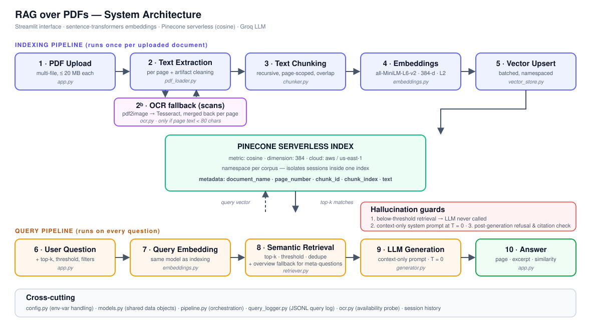

# 📘 Intermediate RAG System Using Pinecone Vector Database

A Retrieval-Augmented Generation system that answers questions **strictly from uploaded PDF
documents**, with page-level source attribution, similarity scores and explicit refusal when
the documents do not contain the answer.



---

## 1. What it does

```
PDF Upload → Text Extraction → Chunking → Embeddings → Pinecone Index
                                                            ↓
Answer + Sources ← LLM Generation ← Semantic Retrieval ←────┘
```

* Upload one or more PDFs (≤ 20 MB each).
* Text is extracted per page, cleaned of PDF artifacts, and split into overlapping chunks.
* Chunks are embedded with `all-MiniLM-L6-v2` and upserted into a **Pinecone serverless index**
  (cosine metric, one namespace per corpus) together with `document_name`, `page_number` and
  `chunk_id` metadata.
* A question is embedded with the same model, matched against the index with an adjustable
  top-k and similarity threshold, and the surviving chunks become the *only* context the LLM
  is allowed to use.
* The answer cites each claim as `[S1]`, `[S2]`… and the UI shows the page number, the source
  excerpt and the cosine similarity behind every citation.
* When nothing clears the threshold the system returns, verbatim:
  > The answer is not available in the provided document.

---

## 2. Quick start

### 2.1 Prerequisites

* Python 3.10 or newer
* A free [Pinecone](https://app.pinecone.io) account → API key
* A free [Groq](https://console.groq.com/keys) account → API key

### 2.2 Install

```bash
python -m venv .venv
```

```bash
.venv\Scripts\activate
```

```bash
pip install -r requirements.txt
```

> On macOS/Linux the activate command is `source .venv/bin/activate`.

### 2.3 Configure

Copy the example environment file and fill in your two API keys:

```bash
copy .env.example .env
```

```ini
PINECONE_API_KEY=pcsk_...
GROQ_API_KEY=gsk_...
```

Nothing else is required — the index is created automatically on first run.

### 2.4 Run

```bash
streamlit run app.py
```

Then open <http://localhost:8501>, upload a PDF on the **Upload** tab, and ask a question on
the **Ask** tab.

---

## 3. OCR for scanned PDFs (optional but recommended)

Scanned or photographed PDFs contain **images of text**, not text. `pypdf` extracts nothing
from them. When OCR is installed, the app detects those pages automatically and reads them with
Tesseract — there is no switch to flip and no separate upload path.

**OCR is entirely optional.** Without it the app runs exactly as before; it simply warns when
you upload a scan instead of silently indexing an empty document.

### 3.1 Install the two system programs

The Python packages in `requirements.txt` (`pytesseract`, `pdf2image`) are thin wrappers. They
need two programs that pip cannot install:

| Program | Purpose |
|---|---|
| **Tesseract OCR** | Recognises text in an image |
| **Poppler** | Used by `pdf2image` to render a PDF page into an image |

**Windows**

1. Tesseract — download the installer from the
   [UB Mannheim build](https://github.com/UB-Mannheim/tesseract/wiki) and run it. Tick
   *"Add Tesseract to PATH"* during setup.
2. Poppler — download the latest ZIP from
   [poppler-windows releases](https://github.com/oschwartz10612/poppler-windows/releases),
   extract it (e.g. to `C:\poppler`), and add the `Library\bin` folder to your PATH.

If you would rather not touch PATH, point the app straight at them in `.env`:

```ini
TESSERACT_CMD=C:\Program Files\Tesseract-OCR\tesseract.exe
POPPLER_PATH=C:\poppler\Library\bin
```

**macOS**

```bash
brew install tesseract poppler
```

**Debian / Ubuntu**

```bash
sudo apt install tesseract-ocr poppler-utils
```

### 3.2 Verify the install

```bash
tesseract --version
```

The app also tells you directly: the sidebar shows **"OCR ready — Tesseract 5.x"** when the
toolchain is working, or a warning with install instructions when it is not.

### 3.3 Extra languages

Only English (`eng`) ships by default. Install a language pack — on Debian/Ubuntu
`sudo apt install tesseract-ocr-deu`, on Windows tick the language during setup — then set it
in `.env`:

```ini
OCR_LANGUAGE=deu
```

Multiple languages are combined with `+`, e.g. `OCR_LANGUAGE=eng+fra`.

### 3.4 OCR settings

| Variable | Default | Meaning |
|---|---|---|
| `OCR_ENABLED` | `true` | Set to `false` to switch the fallback off entirely |
| `OCR_LANGUAGE` | `eng` | Tesseract language pack(s) |
| `OCR_DPI` | `300` | Rasterisation resolution. 300 is the accuracy/speed sweet spot; raise to 400–600 for small or noisy print |
| `OCR_MIN_CHARS` | `80` | A page yielding fewer characters than this is treated as a scan |
| `OCR_MAX_PAGES` | `50` | Upper bound on OCR'd pages per document, so one huge scan cannot hang the UI |
| `TESSERACT_CMD` | *(auto)* | Explicit path to the Tesseract binary |
| `POPPLER_PATH` | *(auto)* | Explicit path to Poppler's `bin` directory |

> OCR is slow relative to the rest of the pipeline — roughly 1–3 seconds per page at 300 DPI.
> A text PDF never pays this cost, because OCR only runs on pages that extracted nothing.

---

## 4. Asking by voice (speech-to-text)

The Ask tab has a microphone beside the question box. Record a question, and the transcript
appears in the box ready to **edit before you submit** — speech never bypasses the normal flow,
it only fills in the text.

Transcription runs **locally** with Whisper. No audio leaves the machine, and no API key is
needed for it.

### 4.1 Install

Nothing extra to install — `faster-whisper` is in `requirements.txt`:

```bash
pip install -r requirements.txt
```

The model downloads automatically the first time you record (~75 MB for `base.en`), cached in
your Hugging Face cache directory thereafter.

`faster-whisper` is a pure pip install with no system binaries. If CTranslate2 has no wheel for
your Python version, install the reference implementation instead — the code falls back to it
automatically:

```bash
pip install openai-whisper
```

That fallback additionally needs the `ffmpeg` binary on PATH.

### 4.2 Browser permissions

The first recording triggers the browser's microphone prompt — click **Allow**. Two things to
know:

* Browsers only allow recording on `localhost` or over **HTTPS**. Running Streamlit on a plain
  `http://` LAN address will silently block the microphone.
* If you denied it once, the prompt will not reappear. Click the padlock (or camera/mic icon) in
  the address bar, allow microphone access for the site, and reload.

The app shows this guidance inline whenever recording fails.

### 4.3 Settings

| Variable | Default | Meaning |
|---|---|---|
| `STT_ENABLED` | `true` | Set to `false` to hide the microphone entirely |
| `STT_MODEL` | `base.en` | `tiny.en`, `base.en`, `small.en`, `medium`, `large-v3` — bigger is more accurate and slower |
| `STT_DEVICE` | `cpu` | Set to `cuda` if you have a GPU with CUDA configured |
| `STT_COMPUTE_TYPE` | `int8` | `int8` is the CPU sweet spot; use `float16` on GPU |
| `STT_LANGUAGE` | *(blank)* | Blank auto-detects. Set e.g. `en`, `fr` to force a language |
| `STT_BEAM_SIZE` | `5` | Higher is marginally more accurate and slower |
| `STT_MAX_AUDIO_MB` | `25` | Rejects overlong recordings before they reach the model |

> Measured on CPU with `base.en`: a 3.8-second question transcribes in **0.86 s** once the model
> is loaded (~4.5× realtime). The first recording of a session additionally pays a ~5 s model
> load, plus the one-off download.

### 4.4 Behaviour notes

* **Silence is not an error.** Voice-activity filtering trims quiet audio; if nothing is left the
  app reports "No speech was detected" and leaves your typed question untouched.
* **Failures never destroy your text.** If transcription fails for any reason, whatever you had
  typed in the question box stays exactly as it was.
* **Speech is optional.** With no Whisper backend installed the panel explains how to add one,
  and the rest of the app — typing, retrieval, OCR, history — is unaffected.

---

## 5. Project structure

```
.
├── app.py                     # Streamlit interface — presentation only
├── src/
│   ├── config.py              # environment variables, validation, defaults
│   ├── models.py              # shared data objects (Document, Chunk, Answer, …)
│   ├── pdf_loader.py          # ① extraction + artifact cleaning + validation
│   ├── ocr.py                 # ①ᵇ Tesseract fallback for scanned pages
│   ├── chunker.py             # ② recursive, page-scoped chunking with overlap
│   ├── embeddings.py          # ③ pluggable embedding backends
│   ├── vector_store.py        # ④ all Pinecone access (create/upsert/query/filter)
│   ├── retriever.py           # ⑤ top-k, threshold, metadata filters, de-duplication
│   ├── generator.py           # ⑥ grounded LLM generation + confidence scoring
│   ├── query_logger.py        # JSONL query log + logging configuration
│   └── pipeline.py            # orchestration; the only class app.py talks to
├── tests/                     # 109 unit tests; no API keys, Tesseract or microphone needed
├── docs/
│   ├── architecture.svg       # architecture diagram
│   ├── architecture.md        # diagram source (Mermaid) + data-flow notes
│   └── technical_report.md    # design decisions, configuration, analysis
└── logs/                      # created at runtime: queries.jsonl + app.log (git-ignored)
```

The dependency direction is strictly one-way — `app.py → pipeline.py → {loader, chunker,
embeddings, vector_store, retriever, generator}` — so the pipeline can be driven from a
FastAPI route, a notebook or a test without changing a line of domain code.

---

## 6. Pinecone integration

| Capability | Where | Notes |
|---|---|---|
| Index creation | `vector_store.py :: _ensure_index` | Serverless, created on demand, waits for `ready`, verifies the existing index's dimension matches the embedding model |
| Namespace usage | `sanitize_namespace`, every call | One namespace per corpus/session; keeps multiple document sets isolated inside one free-tier index |
| Upserting vectors | `upsert_chunks` | Batches of 96 with retry and backoff |
| Querying vectors | `query` | Cosine top-k with `include_metadata=True` |
| Managing metadata | `Chunk.to_metadata`, `build_metadata_filter` | `document_name`, `page_number`, `chunk_id`, `chunk_index`, `text`; filters use `$in` and `$gte`/`$lte` |

---

## 7. Requirement coverage

### Functional

| # | Requirement | Implementation |
|---|---|---|
| 1 | PDF upload, ≥ 1 file, ≤ 20 MB | `st.file_uploader(accept_multiple_files=True)`; size enforced in `validate_pdf_bytes` |
| 2 | Extraction, artifact removal, intelligent chunking | `pdf_loader.clean_text` (de-hyphenation, soft-wrap joining, page-furniture and ligature removal) + `chunker` recursive splitter; scanned pages fall back to `ocr.py` automatically |
| 3 | Embeddings + metadata in Pinecone | `embeddings.py` → `vector_store.upsert_chunks`; page number, document name and chunk ID all stored |
| 4 | Top-k, cosine, adjustable threshold | `retriever.retrieve`, index metric `cosine`, threshold slider |
| 5 | Context-only answers, fixed refusal string | `generator.py`, three independent guards (see §7) |
| 6 | Source attribution | Page number, excerpt and similarity rendered per source in `app.py :: render_answer` |

### Non-functional

Modular packages with one responsibility each, a strict separation between interface and
domain logic, all secrets read through `config.py`, and typed error classes
(`PDFProcessingError`, `ChunkingError`, `EmbeddingError`, `VectorStoreError`,
`RetrievalError`, `GenerationError`, `OCRError`) surfaced as actionable messages in the UI.

### Intermediate enhancements — all seven implemented

1. **Multi-document support** — multiple uploads per namespace, each answer attributed to its own document.
2. **Query history (session memory)** — the *History* tab, held in `st.session_state`.
3. **Adjustable chunk size** — sidebar sliders for both size and overlap.
4. **Adjustable top-k retrieval** — sidebar slider, 1–15.
5. **Metadata filtering** — restrict retrieval to selected documents and/or a page range.
6. **Confidence scoring display** — blended retrieval/citation score with a High/Medium/Low label.
7. **Logging user queries** — `logs/queries.jsonl`, one JSON record per question, viewable in-app.

---

## 8. How hallucination is prevented

1. **Retrieval gate.** If no chunk clears the similarity threshold, the LLM is never called and
   the refusal sentence is returned directly. No context, no generation, no opportunity to invent.
2. **Prompt contract.** A strict system prompt forbids outside knowledge, requires an inline
   `[S#]` citation for every claim, and mandates the exact refusal sentence. Generation runs at
   `temperature=0`.
3. **Post-generation check.** The response is scanned for the refusal sentence and for citation
   markers; only the sources the answer actually cited are displayed, and the citation rate feeds
   the confidence score.

### The one deliberate exception: overview questions

*"What is this document about?"* scores **0.082** against its own document — barely above an
entirely unrelated question at **0.040** — because the embedding model compares *meaning*, and a
question about a document shares no meaning with its subject matter. No threshold can separate
those two cases.

Such questions are therefore answered from a **metadata-filtered** query for the document's
opening chunks (`chunk_index < 4`) rather than from a similarity match. This is not a loosening
of the guarantee:

* it fires **only** when the similarity pass returned nothing, so specific questions are untouched;
* it fires **only** for recognised meta-phrasings — *"What is the capital of France?"* is still
  refused;
* the context is still real, citable text from the indexed corpus, with page numbers;
* the answer is marked as overview-derived in the UI, the query log, and the confidence score
  (which is capped below the "High" band).

Full analysis in [`docs/technical_report.md`](docs/technical_report.md) §5.3.

---

## 9. Tests

```bash
python -m pytest tests -q
```

109 tests cover text cleaning, PDF validation, the chunking algorithm (page scoping, overlap
behaviour, punctuation preservation, parameter validation), retrieval de-duplication, Pinecone
response normalisation, metadata filter composition, refusal detection, confidence scoring and
namespace sanitisation.

26 of those cover OCR specifically: scan detection at the page-threshold boundary, native/OCR
text merging without duplication, the text-PDF path proving OCR is *never* invoked, mixed
documents where only image pages are OCR'd, the sidebar status panel in both states (driven by
Streamlit's headless `AppTest`), and every degradation path (Tesseract missing, Poppler missing,
OCR disabled, OCR recovering nothing).

A further 18 cover the overview fallback (§8) — including the guarantee that it does **not**
weaken refusal for genuinely unanswerable questions.

32 cover speech-to-text: recording validation (missing, too short, oversized), backend selection
and preference order, transcript formatting, and every failure path — no backend installed,
decoder crash, empty recording, and silence. The UI tests assert that a failed or empty
transcription **leaves an already-typed question untouched**.

**None of them need API keys, network access, or a Tesseract install** — the OCR call itself is
stubbed, so the suite runs anywhere.

---

## 10. Troubleshooting

| Symptom | Cause and fix |
|---|---|
| `Configuration incomplete` on startup | `.env` is missing or a key is blank. Copy `.env.example` → `.env`. |
| `Index … has dimension X but the model produces Y` | An existing index was built with a different embedding model. Set `PINECONE_INDEX_NAME` to a new name, or delete the old index. |
| `No selectable text found … OCR could not run` | The PDF is a scan and the OCR toolchain is missing. Install Tesseract and Poppler — see §3. |
| Sidebar says *OCR unavailable* | Tesseract or Poppler is not on PATH. Install them, or set `TESSERACT_CMD` / `POPPLER_PATH` in `.env`. Restart the app afterwards. |
| `No text could be extracted … even with OCR` | The scan is too low-resolution or too noisy. Raise `OCR_DPI` to 400–600, or rescan at higher quality. |
| OCR is very slow | Expected: 1–3 s per page at 300 DPI. Lower `OCR_DPI`, or cap work with `OCR_MAX_PAGES`. |
| OCR output is garbled | Wrong language pack. Set `OCR_LANGUAGE` to match the document (`eng+fra` combines two). |
| Namespace shows 0 vectors right after indexing | Pinecone is eventually consistent; wait a few seconds and re-run the query. |
| `torch` wheels fail to install | Set `EMBEDDING_BACKEND=pinecone` and `EMBEDDING_DIMENSION=1024` in `.env` to use Pinecone's hosted embeddings instead — no local model needed. |
| Answers always refuse | The threshold is too high for your document. Lower it to ~0.25 in the sidebar. |

---

## 11. Deliverables

* **Source code** — this repository.
* **Architecture diagram** — [`docs/architecture.svg`](docs/architecture.svg) (Mermaid source in [`docs/architecture.md`](docs/architecture.md)).
* **Technical report** — [`docs/technical_report.md`](docs/technical_report.md).
