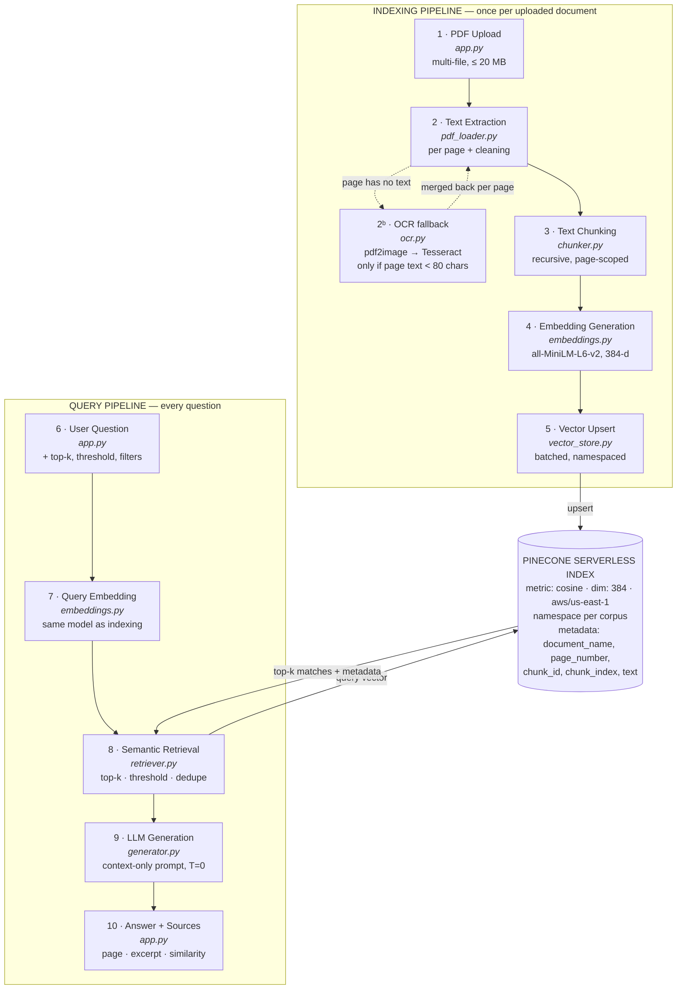
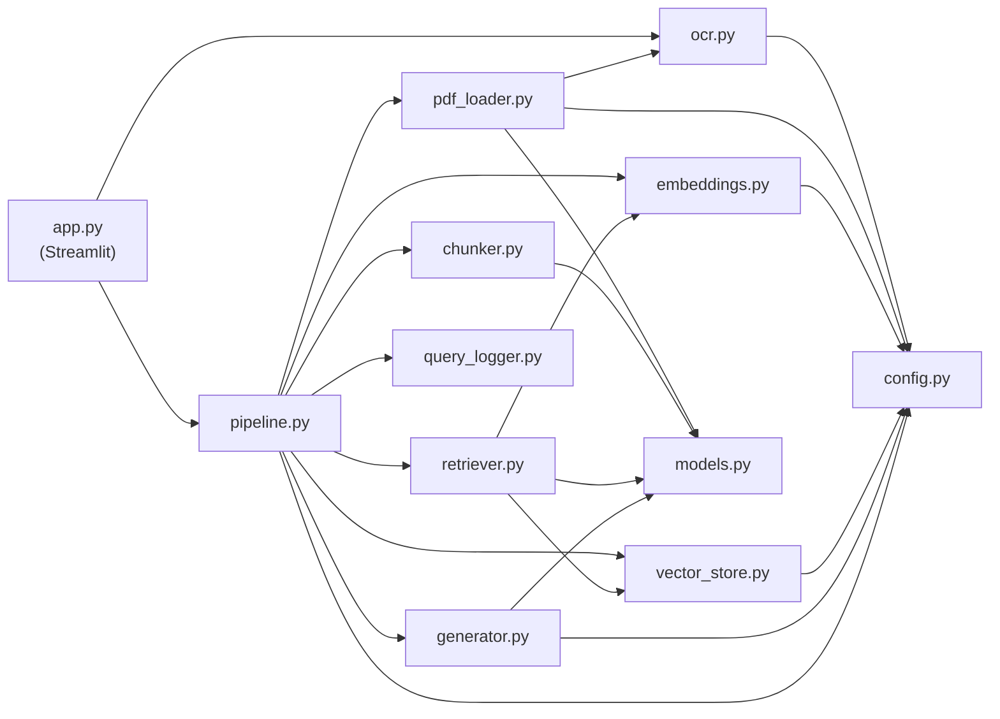

# Architecture

The rendered diagram is [`architecture.svg`](architecture.svg). The Mermaid source below is the
editable version of the same design.

## 1. Pipeline diagram

## 2. Module dependency graph

Dependencies run in one direction only; nothing in `src/` imports Streamlit.

## 3. Data flow

### 3.1 Indexing

| Step | Input | Output | Owner |
|---|---|---|---|
| Validate | uploaded bytes + filename | — (raises `PDFProcessingError`) | `pdf_loader.validate_pdf_bytes` |
| Extract | PDF bytes | `Document(pages=[PageText(page_number, text, source)])` | `pdf_loader.load_pdf` |
| Clean | raw page text | de-hyphenated, unwrapped, furniture-free text | `pdf_loader.clean_text` |
| Detect scans | cleaned page text | page numbers below `OCR_MIN_CHARS` | `ocr.needs_ocr` |
| OCR *(only those pages)* | PDF bytes + page numbers | `{page_number: raw_text}` | `ocr.ocr_page_numbers` |
| Merge | native text + OCR text | one page text, de-duplicated | `ocr.merge_page_text` |
| Chunk | `Document` | `list[Chunk]` with `chunk_id`, `page_number`, `chunk_index` | `chunker.chunk_document` |
| Embed | chunk texts | `ndarray (n, 384)`, L2-normalised | `embeddings.embed_documents` |
| Upsert | chunks + vectors + namespace | vectors in Pinecone | `vector_store.upsert_chunks` |

### 3.2 Querying

| Step | Input | Output | Owner |
|---|---|---|---|
| Embed query | question text | `ndarray (384,)` | `embeddings.embed_query` |
| Build filter | selected docs, page range | Pinecone filter dict (`$in`, `$gte`/`$lte`) | `vector_store.build_metadata_filter` |
| Search | query vector, namespace, filter | raw matches (over-fetched 3×) | `vector_store.query` |
| Gate | matches | `RetrievalResult` (threshold applied, de-duplicated, trimmed to top-k) | `retriever.retrieve` |
| Overview fallback *(only if the gate emptied and the query is a meta-question)* | query + filters | opening chunks (`chunk_index < 4`) in reading order | `retriever._retrieve_overview` |
| Generate | `RetrievalResult` | `Answer` (text, sources, confidence, grounded) | `generator.generate` |
| Log | result + answer | one JSONL record | `query_logger.log_query` |
| Render | `Answer` | answer, confidence, per-source page/excerpt/score | `app.render_answer` |

## 4. Key design points

**Page-scoped chunking.** Chunks never span a page boundary. This costs a little context at page
breaks but guarantees that every chunk has one unambiguous page number — which is what makes the
source attribution trustworthy rather than approximate.

**Namespaces over indexes.** The Pinecone free tier allows a limited number of indexes but
unlimited namespaces. Using one namespace per corpus gives isolation between document sets and
sessions at no quota cost, and makes "clear my corpus" a single `delete(delete_all=True)` call.

**Normalised vectors.** All embeddings are L2-normalised before upsert, so cosine similarity and
dot product agree and scores fall in an interpretable range — necessary for the similarity
threshold to mean the same thing across models.

**Over-fetch then filter.** Retrieval asks Pinecone for `3 × top_k` candidates, then applies the
threshold and de-duplication locally before trimming to `top_k`. Without this, near-identical
overlapping chunks would consume the context budget and crowd out genuinely distinct evidence.

**OCR is a fallback, not a stage.** OCR sits *inside* extraction rather than as a pipeline step,
because it only ever runs for the subset of pages that produced no text. A text PDF's path through
the system is byte-for-byte what it was before OCR existed, and the toolchain being absent
degrades to a warning rather than an error — OCR is an enhancement, never a dependency.

**Two retrieval modes, not one threshold.** Similarity search answers questions about *content*.
A question about the *document itself* ("what is this about?") scores near zero against that
document — 0.082, against 0.040 for a wholly unrelated question — so no threshold can separate
them. Those queries are served instead by a metadata-filtered query for the opening chunks. It
fires only when similarity found nothing *and* the phrasing is recognised as a meta-question, so
genuinely unanswerable questions are still refused.

**Three-point hallucination defence.** A retrieval gate (no context → no LLM call), a strict
context-only prompt at `temperature=0`, and a post-generation refusal-and-citation check. Each
works even if the other two fail.
